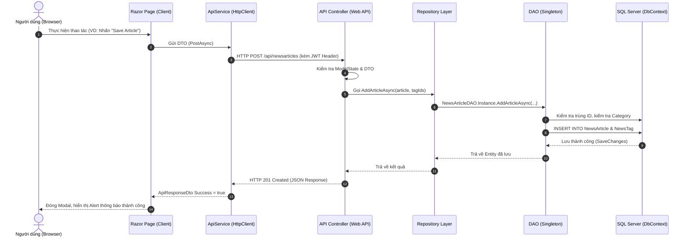

# BÁO CÁO PHÂN TÍCH CHI TIẾT DỰ ÁN FU NEWS MANAGEMENT SYSTEM
> **Môn học**: PRN232 - Assignment 01  
> **Nền tảng**: .NET 8 (ASP.NET Core Web API + OData v8 + Entity Framework Core 8 + ASP.NET Core Razor Pages)  
> **Tác giả**: Lê Thanh Hùng  

---

## MỤC LỤC
1. [Tổng quan dự án & Kiến trúc tổng thể](#1-tổng-quan-dự-án--kiến-trúc-tổng-thể)
2. [Các thành phần cốt lõi và ý nghĩa](#2-các-thành-phần-cốt-lõi-và-ý-nghĩa)
3. [Tầng Controller: Vai trò, phương thức và tác dụng chi tiết](#3-tầng-controller-vai-trò-phương-thức-và-tác-dụng-chi-tiết)
   - [3.1. AuthController (`api/auth`)](#31-authcontroller-apiauth)
   - [3.2. AccountsController (`api/accounts`)](#32-accountscontroller-apiaccounts)
   - [3.3. CategoriesController (`api/categories`)](#33-categoriescontroller-apicategories)
   - [3.4. NewsArticlesController (`api/newsarticles`)](#34-newsarticlescontroller-apinewsarticles)
   - [3.5. TagsController (`api/tags`)](#35-tagscontroller-apitags)
   - [3.6. ReportsController (`api/reports`)](#36-reportscontroller-apireports)
4. [Luồng luân chuyển dữ liệu (Data & Request Flow)](#4-luồng-luân-chuyển-dữ-liệu-data--request-flow)
5. [Cơ chế Phân quyền (Role-Based Authorization) & Ràng buộc nghiệp vụ](#5-cơ-chế-phân-quyền-role-based-authorization--ràng-buộc-nghiệp-vụ)

---

## 1. TỔNG QUAN DỰ ÁN & KIẾN TRÚC TỔNG THỂ

Dự án **FU News Management System** là hệ thống quản lý tin tức trường đại học, xây dựng theo mô hình **Client - Server phân tách hoàn toàn (Decoupled Architecture)**:

```
Assignment/
├── 27_Assignment01_BackEnd/       # Solution Backend Web API
│   └── FUNewsManagementAPI/       # Dự án Web API duy nhất (Single Project Pattern)
│       ├── Controllers/           # Tiếp nhận HTTP Request & OData endpoints
│       ├── DAO/                   # Xử lý truy vấn CSDL (Singleton Pattern) + DbContext
│       ├── DTOs/                  # Đối tượng truyền nhận dữ liệu
│       ├── Models/                # Entity Framework Core Data Entities
│       └── Repositories/          # Interface & Implementation (Repository Pattern)
│
├── 27_Assignment01_FrontEnd/      # Solution Frontend Client
│   └── FUNewsManagementClient/    # Ứng dụng Razor Pages tiêu thụ API qua HttpClient
│       ├── Pages/                 # Giao diện người dùng (Public, Admin, Staff)
│       ├── Services/              # ApiService gọi Backend API
│       ├── Helpers/               # Quản lý Session & Cookie
│       └── DTOs/                  # DTO độc lập phía Client (Loose Coupling)
│
└── FUNewsManagement.sql           # Kịch bản khởi tạo Cơ sở dữ liệu SQL Server
```

### Điểm nổi bật về mặt kỹ thuật:
- **Single Project Backend**: Gom toàn bộ Controllers, Repositories, DAO, DTOs, Models trong 1 project `FUNewsManagementAPI` duy nhất, đáp ứng đúng yêu cầu cấu trúc gọn nhẹ mà vẫn giữ chuẩn kiến trúc phân tầng.
- **Không phụ thuộc nhị phân (Zero Binary Dependency)**: Client không tham chiếu đến DLL của Backend mà giao tiếp 100% qua chuẩn giao thức **RESTful HTTP/JSON** và **OData v8**.
- **OData v8**: Cho phép các Controller trả về `IQueryable` kết hợp attribute `[EnableQuery]`, hỗ trợ client tự lọc, sắp xếp, phân trang bằng các cú pháp chuẩn như `$filter`, `$orderby`, `$select`, `$top`, `$skip`.

---

## 2. CÁC THÀNH PHẦN CỐT LÕI VÀ Ý NGHĨA

| Thành phần | Thư mục | Ý nghĩa & Trách nhiệm |
| :--- | :--- | :--- |
| **Models (Entities)** | `Models/` | Đại diện cho các bảng trong SQL Server (`Category`, `NewsArticle`, `NewsTag`, `SystemAccount`, `Tag`). Chứa các quan hệ Navigation Properties giữa các bảng (1-n, n-n). |
| **DbContext** | `DAO/` | `FUNewsManagementDbContext` kế thừa từ `DbContext` của Entity Framework Core, cấu hình quan hệ khóa chính, khóa ngoại, quan hệ n-n giữa NewsArticle và Tag qua bảng trung gian NewsTag. |
| **DAO (Data Access Object)** | `DAO/` | Áp dụng thiết kế **Singleton Pattern** (`Instance`). Đây là nơi duy nhất trực tiếp tương tác với `DbContext` để thực hiện câu lệnh LINQ / SQL. Chịu trách nhiệm kiểm tra toàn vẹn dữ liệu (trùng ID, trùng Email, v.v.). |
| **Repositories** | `Repositories/` | Áp dụng **Repository Pattern** với Interface (`IRepository`) và Class thực thi (`Repository`). Tách rời tầng Controller khỏi tầng truy cập dữ liệu, hỗ trợ **Dependency Injection (DI)** vào Controller. |
| **DTOs (Data Transfer Objects)** | `DTOs/` | Định hình dữ liệu gửi lên và trả về giữa Client và API. Giúp: <br>1. Che giấu các trường nhạy cảm (như mật khẩu không trả ra ngoài).<br>2. Tránh lỗi đệ quy vòng (Cyclic References) khi serialize quan hệ 2 chiều trong EF Core.<br>3. Ngăn chặn tấn công Over-posting / Mass Assignment. |
| **Controllers** | `Controllers/` | Tầng xử lý tiếp nhận Request từ mạng, validate `ModelState`, điều phối các Repository và trả về Response với HTTP Status Code thích hợp. |
| **ApiService** | Client `Services/` | Được cấu hình `HttpClient` tập trung, đóng gói việc gọi API (GET, POST, PUT, DELETE), quản lý `Authorization: Bearer <token>` và parse JSON an toàn. |

---

## 3. TẦNG CONTROLLER: VAI TRÒ, Ý NGHĨA CÁC METHOD, MỤC ĐÍCH VÀ TÁC DỤNG CHI TIẾT

### 3.0. Controller dùng để làm gì?
Controller trong kiến trúc ASP.NET Core Web API là **Tầng điều khiển trung tâm (API Gateway / Presentation Layer)** của hệ thống BackEnd:
1. **Tiếp nhận & Định tuyến (Routing)**: Phân tích đường dẫn URL từ Client gửi lên (ví dụ: `GET /api/accounts/3` hoặc `POST /api/auth/login`) để điều phối đến đúng Action Method tương ứng.
2. **Khai thác tham số (Model Binding) & Rà soát dữ liệu (Validation)**:
   - Tự động bóc tách tham số từ Route (`[FromRoute]`), Query String (`[FromQuery]`), hoặc JSON Body (`[FromBody]`).
   - Kiểm tra tính hợp lệ qua `ModelState.IsValid` (ví dụ: bắt buộc nhập, định dạng email, độ dài chuỗi). Nếu sai trả ngay `400 Bad Request`.
3. **Điều phối nghiệp vụ (Orchestration)**: Gọi tầng **Repository** (thông qua Dependency Injection) để thực thi nghiệp vụ và lấy dữ liệu từ CSDL, hoàn toàn không gọi trực tiếp `DbContext`.
4. **Phản hồi chuẩn RESTful & HTTP Status Code**: Đóng gói dữ liệu đầu ra và gán mã trạng thái mạng chính xác:
   - `200 OK`: Truy vấn, cập nhật hoặc xóa thành công.
   - `201 Created`: Tạo mới thành công (kèm header `Location` trỏ đến tài nguyên vừa tạo).
   - `400 Bad Request`: Dữ liệu đầu vào sai cú pháp hoặc vi phạm ràng buộc logic (ví dụ: xóa tài khoản đã có bài viết).
   - `401 Unauthorized`: Chưa đăng nhập hoặc sai thông tin xác thực.
   - `404 Not Found`: Không tìm thấy bản ghi với ID yêu cầu.
   - `409 Conflict`: Xung đột dữ liệu (ví dụ: trùng khóa chính ID hoặc trùng Email).
   - `500 Internal Server Error`: Lỗi hệ thống ngoài ý muốn.
5. **Tích hợp OData v8 (`[EnableQuery]`)**: Tự động chuyển đổi các tham số URL chuẩn OData (`$filter`, `$orderby`, `$select`, `$top`, `$skip`, `$count`) thành câu lệnh SQL truy vấn trực tiếp dưới Database cực kỳ tối ưu, giúp Client linh hoạt lấy đúng dữ liệu mình cần.

> **Giải thích về Route trên Swagger (tại sao có cả `/api/Accounts` và `/odata/Accounts`?)**:
> - Nhánh `/api/Accounts`: Là tuyến đường RESTful API truyền thống được định nghĩa qua `[Route("api/[controller]")]`.
> - Nhánh `/odata/Accounts` & `/odata/Accounts/$count`: Được bộ máy OData v8 tự động đăng ký trong `Program.cs` thông qua `modelBuilder.EntitySet<SystemAccount>("Accounts")` và `options.AddRouteComponents("odata", GetEdmModel())`. Tuyến này cho phép truy vấn theo đúng chuẩn giao thức mở quốc tế OData OASIS Standard (đếm tổng số bản ghi qua `$count`, truy vấn metadata qua `$metadata`).

---

### 3.1. `AuthController` (`Route: api/auth`)
*Cổng xác thực danh tính duy nhất của toàn bộ hệ thống.*

#### `POST /api/auth/login`
- **Mục đích**: Xác thực người dùng (Đăng nhập) và cấp phát chuỗi mã hóa bảo mật JSON Web Token (JWT Bearer Token).
- **Tham số đầu vào**:
  - `[FromBody] LoginRequest request`: Gồm `Email` (chuỗi định dạng email) và `Password` (chuỗi mật khẩu).
- **Mã phản hồi (HTTP Status Codes)**:
  - `200 OK`: Đăng nhập thành công, trả về đối tượng `LoginResponse` (gồm: AccountId, AccountName, AccountEmail, Role, Token).
  - `400 Bad Request`: Dữ liệu đầu vào không hợp lệ (để trống email hoặc password).
  - `401 Unauthorized`: Sai email hoặc mật khẩu (`"Invalid email or password."`).
- **Ý nghĩa & Tác dụng thực tế**:
  1. **Ưu tiên kiểm tra tài khoản Quản trị viên (Admin)**: So khớp trực tiếp với thông tin cấu hình trong `appsettings.json` (`admin@FUNewsManagementSystem.org` / `admin`). Nếu khớp, hệ thống lập tức cấp quyền `Role = "Admin"` mà không cần tốn chi phí truy vấn cơ sở dữ liệu.
  2. **Kiểm tra tài khoản trong Database**: Nếu không phải Admin, chuyển sang gọi `_accountRepository.LoginAsync(email, password)`. Kiểm tra mật khẩu và chuyển đổi mã số vai trò: `AccountRole = 1` ➔ vai trò `Staff`, `AccountRole = 2` ➔ vai trò `Lecturer`.
  3. **Ký số JWT Token**: Sinh mã JWT chứa các `Claims` định danh: `NameIdentifier` (ID), `Name` (Tên), `Email`, `Role` (Vai trò) với thuật toán HMAC-SHA256, thời hạn 180 phút. Token này được trả về để Client gửi kèm trong Header `Authorization: Bearer <token>` ở mọi tác vụ quản trị tiếp theo.

---

### 3.2. `AccountsController` (`Route: api/accounts` & `odata/Accounts`)
*Kế thừa `ODataController` - Phụ trách toàn bộ nghiệp vụ quản lý tài khoản người dùng (`SystemAccount`) dành riêng cho Admin.*

#### 1. `GET /api/accounts` (và `GET /odata/Accounts`, `GET /odata/Accounts/$count`)
- **Mục đích**: Lấy danh sách toàn bộ tài khoản nhân viên (Staff) và giảng viên (Lecturer) trong hệ thống.
- **Tham số**: Không bắt buộc. Hỗ trợ toàn bộ cú pháp truy vấn OData qua URL (ví dụ: `$filter=accountRole eq 1`, `$orderby=accountName asc`, `$top=10`, `$skip=0`).
- **Đầu ra**: `200 OK` kèm danh sách `IEnumerable<AccountResponseDto>`.
- **Tác dụng**:
  - Dữ liệu trả về được đóng gói qua `AccountResponseDto`, **tuyệt đối không trả về mật khẩu** (`AccountPassword`) ra ngoài, đảm bảo an toàn tuyệt đối.
  - Tự động thống kê số bài viết do từng tài khoản đã đăng (`CreatedArticlesCount = a.CreatedNewsArticles.Count`) để Admin tiện theo dõi hiệu suất làm việc của nhân viên.
  - Hỗ trợ `$count` để Client biết tổng số lượng tài khoản phục vụ phân trang.

#### 2. `GET /api/accounts/{id}`
- **Mục đích**: Xem chi tiết thông tin của 1 tài khoản cụ thể theo mã định danh.
- **Tham số**: `[FromRoute] short id` (Mã số tài khoản cần tìm).
- **Mã phản hồi**:
  - `200 OK`: Trả về thực thể tài khoản.
  - `404 Not Found`: Không tìm thấy tài khoản với mã `id` yêu cầu.
- **Tác dụng**: Phục vụ việc xem chi tiết hoặc nạp dữ liệu cũ vào form trước khi chỉnh sửa.

#### 3. `POST /api/accounts`
- **Mục đích**: Tạo mới một tài khoản người dùng hệ thống (chức năng "Add New Account" của Admin).
- **Tham số**: `[FromBody] AccountCreateUpdateDto dto` (gồm: AccountId, AccountName, AccountEmail, AccountRole, AccountPassword).
- **Mã phản hồi**:
  - `201 CreatedAtAction`: Tạo thành công, trả về header `Location` trỏ đến `GET /api/accounts/{id}` và object tài khoản vừa tạo.
  - `400 Bad Request`: Form nhập thiếu dữ liệu bắt buộc.
  - `409 Conflict`: Trùng mã tài khoản (`AccountId already exists`) hoặc trùng Email (`AccountEmail already exists`), hoặc cố tình đặt email trùng với email Admin tối cao.
- **Tác dụng & Cơ chế tự động**:
  - Đảm bảo tính duy nhất của tài khoản trên toàn hệ thống.
  - Kết hợp với Client tự động tính toán ID tiếp theo (ví dụ: đang có ID 1..5 thì tự gợi ý ID 6). Nếu Client gửi ID = 0, Backend tự động lấy `Max(AccountId) + 1` làm khóa chính.

#### 4. `PUT /api/accounts/{id}`
- **Mục đích**: Cập nhật thông tin tài khoản hiện có (Tên, Email, Phân quyền Role, Mật khẩu).
- **Tham số**: `[FromRoute] short id` (Mã tài khoản cần sửa), `[FromBody] AccountCreateUpdateDto dto` (Dữ liệu mới).
- **Mã phản hồi**:
  - `200 OK`: Cập nhật thành công, trả về thông tin tài khoản sau khi sửa.
  - `404 Not Found`: Không tìm thấy tài khoản với `id` truyền vào.
  - `409 Conflict`: Email mới bị trùng với một tài khoản khác trong cơ sở dữ liệu.
- **Tác dụng**: Cho phép Admin điều chỉnh thông tin nhân sự, nâng cấp/hạ cấp quyền hạn giữa Staff và Lecturer, hoặc đặt lại mật khẩu mới.

#### 5. `DELETE /api/accounts/{id}`
- **Mục đích**: Xóa vĩnh viễn một tài khoản khỏi hệ thống.
- **Tham số**: `[FromRoute] short id` (Mã tài khoản cần xóa).
- **Mã phản hồi**:
  - `200 OK`: Xóa thành công.
  - `400 Bad Request`: **BỊ CHẶN XÓA DO RÀNG BUỘC NGHIỆP VỤ**.
  - `404 Not Found`: Tài khoản không tồn tại.
- **Ý nghĩa ràng buộc sống còn**:
  - Hệ thống kiểm tra trước: `await _accountRepository.HasCreatedArticlesAsync(id)`.
  - Nếu tài khoản này đã từng là tác giả của bất kỳ bài viết tin tức nào, API sẽ **từ chối xóa** và trả về thông báo lỗi: *"Cannot delete this account because it has created news articles."*
  - **Tác dụng**: Ngăn chặn hiện tượng dữ liệu mồ côi (Orphan records), bảo vệ toàn vẹn lịch sử tác giả của các bài báo đã phát hành.

#### 6. `PUT /api/accounts/profile/{id}`
- **Mục đích**: Cho phép nhân viên (Staff) tự quản lý và cập nhật hồ sơ cá nhân của chính mình mà không cần nhờ đến Admin.
- **Tham số**: `[FromRoute] short id`, `[FromBody] ProfileUpdateDto dto` (AccountName, AccountEmail, NewPassword).
- **Mã phản hồi**: `200 OK` (thành công), `404 Not Found` (không tìm thấy tài khoản).
- **Tác dụng**: Cho phép nhân viên đổi tên hiển thị, cập nhật email liên hệ hoặc đổi mật khẩu mới (nếu ô NewPassword để trống thì giữ nguyên mật khẩu cũ).

---

### 3.3. `CategoriesController` (`Route: api/categories` & `odata/Categories`)
*Kế thừa `ODataController` - Quản lý cây danh mục chuyên mục tin tức (`Category`). Hỗ trợ phân cấp Danh mục Cha - Danh mục Con.*

#### 1. `GET /api/categories` (và `GET /odata/Categories`, `GET /odata/Categories/$count`)
- **Mục đích**: Lấy danh sách toàn bộ các danh mục tin tức.
- **Tham số**: `[FromQuery] bool? activeOnly` (Tùy chọn: nếu truyền `true` thì chỉ lấy danh mục đang hoạt động). Hỗ trợ OData query.
- **Đầu ra**: `200 OK` kèm danh sách `CategoryResponseDto`.
- **Tác dụng**:
  - Trả về kèm tên của danh mục cha (`ParentCategoryName`) để hiển thị dạng cây phân cấp.
  - Trả về số lượng bài viết đang trực thuộc danh mục đó (`ArticleCount = c.NewsArticles.Count`), giúp Staff biết chuyên mục nào đang có nhiều bài viết.
  - Phục vụ cho Dropdown chọn danh mục ở trang công khai và trong Modal tạo bài viết.

#### 2. `GET /api/categories/{id}`
- **Mục đích**: Lấy chi tiết thông tin của 1 danh mục theo mã số `id`.
- **Đầu ra**: `200 OK` (chi tiết danh mục) hoặc `404 Not Found`.

#### 3. `POST /api/categories`
- **Mục đích**: Tạo một chuyên mục tin tức mới (Dành cho Staff).
- **Tham số**: `[FromBody] CategoryCreateUpdateDto dto` (CategoryName, CategoryDesciption, ParentCategoryId, IsActive).
- **Mã phản hồi**: `201 CreatedAtAction` khi tạo thành công.
- **Tác dụng**: Cho phép mở rộng thêm các mảng tin tức mới trong trường học (ví dụ: Tin tuyển sinh, Tin học thuật, Hoạt động CLB).

#### 4. `PUT /api/categories/{id}`
- **Mục đích**: Cập nhật tên chuyên mục, mô tả, thay đổi danh mục cha hoặc bật/tắt trạng thái hoạt động (`IsActive`).
- **Đầu ra**: `200 OK` khi thành công, `404 Not Found` nếu không tìm thấy ID.

#### 5. `DELETE /api/categories/{id}`
- **Mục đích**: Xóa một chuyên mục khỏi hệ thống.
- **Tham số**: `[FromRoute] short id`.
- **Mã phản hồi**:
  - `200 OK`: Xóa thành công.
  - `400 Bad Request`: **BỊ CHẶN XÓA DO RÀNG BUỘC TOÀN VẸN**.
- **Ý nghĩa ràng buộc sống còn**:
  - Kiểm tra xem danh mục có bài viết nào không (`HasNewsArticlesAsync(id)`).
  - Nếu danh mục đang chứa bài viết tin tức hoặc đang có các chuyên mục con trực thuộc, API sẽ **chặn xóa ngay lập tức** với thông báo: *"Cannot delete this category because it contains news articles."*
  - **Tác dụng**: Đảm bảo không làm mất liên kết hoặc làm hỏng dữ liệu của các bài viết đang thuộc chuyên mục đó.

---

### 3.4. `NewsArticlesController` (`Route: api/newsarticles` & `odata/NewsArticles`)
*Kế thừa `ODataController` - Controller trung tâm quan trọng nhất, xử lý toàn bộ vòng đời tin tức và mối quan hệ n-n với Tags.*

#### 1. `GET /api/newsarticles` (và `GET /odata/NewsArticles`, `GET /odata/NewsArticles/$count`)
- **Mục đích**: Truy vấn và lọc danh sách bài viết đa tiêu chí, hỗ trợ OData v8.
- **Tham số**:
  - `activeOnly` (bool?): Lọc bài viết đã xuất bản (`NewsStatus = true`) dành cho khách xem tin.
  - `keyword` (string?): Tìm kiếm từ khóa xuất hiện trong Tiêu đề (Headline), Tựa đề phụ (NewsTitle) hoặc Nội dung (NewsContent).
  - `categoryId` (short?): Lọc theo chuyên mục cụ thể.
  - `tagId` (int?): Lọc các bài viết được gắn thẻ hashtag cụ thể.
  - Hỗ trợ toàn bộ tham số OData: `$filter`, `$orderby`, `$select`, `$top`, `$skip`.
- **Đầu ra**: `200 OK` kèm danh sách DTO đã bao gồm tên chuyên mục, tên tác giả và danh sách các Tags đính kèm.
- **Tác dụng**: Cung cấp dữ liệu trực tiếp cho trang chủ Public News, thanh công cụ tìm kiếm và trang quản trị của Staff.

#### 2. `GET /api/newsarticles/{id}`
- **Mục đích**: Đọc toàn bộ nội dung chi tiết của một bài viết theo mã `id` (chuỗi ký tự, ví dụ: `"1"`, `"NA001"`).
- **Đầu ra**: `200 OK` (chi tiết bài viết) hoặc `404 Not Found`.
- **Tác dụng**: Cung cấp nội dung đầy đủ cho Popup Modal "Read More" ở trang chủ hoặc Modal "Edit Article" của Staff.

#### 3. `GET /api/newsarticles/author/{authorId}`
- **Mục đích**: Lấy toàn bộ lịch sử các bài viết được tạo bởi một tác giả cụ thể.
- **Tham số**: `[FromRoute] short authorId` (Mã số tài khoản nhân viên).
- **Đầu ra**: `200 OK` kèm danh sách bài viết sắp xếp giảm dần theo ngày tạo (`CreatedDate Descending`).
- **Tác dụng**: Phục vụ riêng cho màn hình **"My News History"** của Staff, giúp nhân viên xem lại toàn bộ các bài viết mình đã chấp bút.

#### 4. `POST /api/newsarticles`
- **Mục đích**: Đăng tải / tạo một bài viết tin tức mới (Dành cho Staff).
- **Tham số**:
  - `[FromBody] NewsArticleCreateUpdateDto dto`: Mã bài viết (`NewsArticleId`), Tiêu đề (`Headline`), Nội dung (`NewsContent`), Chuyên mục (`CategoryId`), Trạng thái (`NewsStatus`), Nguồn tin (`NewsSource`), Danh sách Tag IDs (`TagIds`).
  - `[FromQuery] short? createdById`: Mã tài khoản của nhân viên đang đăng bài.
- **Mã phản hồi**:
  - `201 CreatedAtAction`: Tạo thành công.
  - `409 Conflict`: Trùng mã bài viết `NewsArticleId`.
  - `400 Bad Request`: Thiếu thông tin bắt buộc hoặc `CategoryId` không tồn tại trong CSDL.
- **Ý nghĩa & Tác dụng**:
  - **Tự động gợi ý & tính toán mã bài viết tiếp theo (Next Article ID)**: Client tự động tính toán mã số tiếp theo dạng tăng dần (ví dụ: đang có ID 1..5 thì tự nạp ID #6) tương tự cơ chế của Account ID, giúp nhân viên không phải tự đoán mã ID tránh trùng lặp.
  - Phía Backend DAO cũng tích hợp cơ chế tự động sinh ID tiếp theo nếu Client gửi ID trống hoặc "0".
  - Tự động gán thời điểm tạo `CreatedDate = DateTime.Now` và người tạo `CreatedById`.
  - Tự động lưu các bản ghi liên kết n-n vào bảng trung gian `NewsTag` cho tất cả các tag được nhân viên tích chọn.

#### 5. `PUT /api/newsarticles/{id}`
- **Mục đích**: Chỉnh sửa bài viết hiện có và đồng bộ lại danh sách thẻ Tag (Dành cho Staff).
- **Tham số**: `[FromRoute] string id`, `[FromBody] NewsArticleCreateUpdateDto dto`, `[FromQuery] short? updatedById`.
- **Mã phản hồi**: `200 OK` (thành công), `404 Not Found` (không tìm thấy bài viết).
- **Tác dụng**:
  - Cập nhật nội dung, tiêu đề, trạng thái xuất bản, ghi nhận người sửa cuối cùng (`UpdatedById`) và thời điểm sửa (`ModifiedDate = DateTime.Now`).
  - **Đồng bộ hóa Tags thông minh**: Tự động so sánh danh sách tag mới gửi lên với tag cũ trong CSDL: Tag nào bị bỏ chọn sẽ xóa khỏi bảng `NewsTag`, Tag nào mới tích chọn sẽ được chèn thêm vào.

#### 6. `DELETE /api/newsarticles/{id}`
- **Mục đích**: Xóa vĩnh viễn bài viết khỏi hệ thống.
- **Tham số**: `[FromRoute] string id`.
- **Mã phản hồi**: `200 OK` (thành công), `404 Not Found` (không tồn tại).
- **Tác dụng**: Tự động dọn sạch tất cả các liên kết trong bảng phụ `NewsTag` trước, sau đó xóa bản ghi chính trong bảng `NewsArticle` để không bị lỗi xung đột khóa ngoại.

---

### 3.5. `TagsController` (`Route: api/tags` & `odata/Tags`)
*Kế thừa `ODataController` - Quản lý kho nhãn dán / Hashtag phân loại tin tức.*

#### 1. `GET /api/tags` (và `GET /odata/Tags`)
- **Mục đích**: Lấy danh mục tất cả các Tag đang có trong hệ thống (như `#Education`, `#Technology`, `#Research`, `#Innovation`).
- **Đầu ra**: `200 OK` kèm danh sách Tag (hỗ trợ OData).
- **Tác dụng**: Cung cấp danh sách các checkbox thẻ Tag để Staff tích chọn khi tạo hoặc sửa bài viết tin tức.

#### 2. `GET /api/tags/{id}`, `POST /api/tags`, `PUT /api/tags/{id}`, `DELETE /api/tags/{id}`
- **Mục đích**: Các phương thức CRUD cơ bản cho thẻ Tag (Xem chi tiết, Thêm mới, Sửa ghi chú/tên tag, Xóa tag).

---

### 3.6. `ReportsController` (`Route: api/reports`)
*Phụ trách phân hệ Báo cáo Thống kê dành riêng cho Quản trị viên (Admin Report).*

#### `GET /api/reports/statistics`
- **Mục đích**: Tạo báo cáo thống kê số lượng và danh sách bài viết trong một khoảng thời gian nhất định theo đúng yêu cầu đề bài Assignment 01.
- **Tham số đầu vào**:
  - `[FromQuery] DateTime startDate`: Ngày bắt đầu thống kê.
  - `[FromQuery] DateTime endDate`: Ngày kết thúc thống kê.
- **Mã phản hồi**:
  - `200 OK`: Trả về đối tượng `ReportStatisticDto` gồm: `StartDate`, `EndDate`, `TotalArticles` (tổng số bài), và danh sách `Articles` chi tiết.
  - `400 Bad Request`: `startDate` lớn hơn `endDate` (`"StartDate must be earlier than or equal to EndDate."`).
- **Ý nghĩa & Tác dụng thực tế**:
  1. **Bảo đảm chuẩn xác mốc thời gian**: Truy vấn CSDL từ đầu ngày bắt đầu (`startDate.Date` - 00:00:00) đến cuối ngày kết thúc (`endDate.Date.AddDays(1).AddTicks(-1)` - 23:59:59).
  2. **Tuân thủ quy định sắp xếp của đề bài**: Kết quả bắt buộc phải được sắp xếp **giảm dần theo ngày tạo (`CreatedDate Descending`)**.
  3. **Đa dạng hóa đầu ra**: Dữ liệu từ API này được Client sử dụng để hiển thị các thẻ KPI thống kê trên giao diện Web, đồng thời là nguồn cấp dữ liệu cho tính năng **Xuất báo cáo ra file Excel (.xlsx)** bằng ClosedXML.

---

## 4. LUỒNG LUÂN CHUYỂN DỮ LIỆU (DATA & REQUEST FLOW)

Sơ đồ tuần tự xử lý một tác vụ từ giao diện người dùng đến cơ sở dữ liệu:



---

## 5. CƠ CHẾ PHÂN QUYỀN (ROLE-BASED AUTHORIZATION) & RÀNG BUỘC NGHIỆP VỤ

### 1. Phân quyền theo 3 vai trò:
- **Khách vãng lai (Public / Anonymous)**:
  - Chỉ xem các bài viết có trạng thái kích hoạt (`NewsStatus == true`).
  - Tìm kiếm bài viết theo từ khóa, lọc theo danh mục, đọc bài viết chi tiết qua Modal.
  - Không thể truy cập vào các đường dẫn quản trị `/Admin/*` hay `/Staff/*`.
- **Nhân viên (Staff - Role 1)**:
  - Quản lý danh mục (Category Management) qua Modal Popup.
  - Quản lý bài viết tin tức (News Article Management) + Chọn gán Tags qua Modal.
  - Xem lịch sử bài viết của chính mình (My News History).
  - Quản lý trang cá nhân (Profile) và đổi mật khẩu.
- **Giảng viên (Lecturer - Role 2)**:
  - Thành viên nội bộ trường đại học (đăng nhập bằng tài khoản trong CSDL có `AccountRole = 2`).
  - Xem tin tức đại học tại Public News Portal.
  - Quản lý trang cá nhân (Profile) và đổi mật khẩu tài khoản của chính mình (`/Staff/Profile`).
  - Được bảo vệ an toàn phân quyền: Không được phép truy cập trái phép vào trang quản trị bài viết/danh mục của Staff hay trang tài khoản của Admin (nếu cố tình vào sẽ bị điều hướng an toàn về trang chủ kèm thông báo từ chối quyền truy cập).
- **Quản trị viên (Admin)**:
  - Quản lý toàn bộ tài khoản hệ thống (SystemAccount Management) qua Modal Popup (tự động gợi ý Account ID theo thứ tự).
  - Thống kê báo cáo bài viết theo khoảng ngày (Report Statistics).
  - Xuất báo cáo bài viết ra định dạng file Excel (`.xlsx`) chuyên nghiệp (sử dụng ClosedXML, định dạng màu sắc header, viền ô, căn lề và tự động điều chỉnh độ rộng cột).

### 2. Các ràng buộc nghiệp vụ chặt chẽ (Business Constraints):
1. **Kiểm tra trùng lặp khóa chính & Email**: Khi thêm tài khoản, hệ thống kiểm tra cả trùng `AccountId` lẫn trùng `AccountEmail`.
2. **Bảo vệ toàn vẹn dữ liệu khi xóa tài khoản**: Cấm xóa tài khoản nếu tài khoản đó đã từng là tác giả đứng tên bất kỳ bài viết nào.
3. **Bảo vệ toàn vẹn dữ liệu khi xóa danh mục**: Cấm xóa danh mục nếu danh mục đó đang chứa bài viết hoặc có danh mục con trực thuộc.
4. **Bảo đảm tính hợp lệ của bài viết**: Khi tạo bài viết, `CategoryId` bắt buộc phải tồn tại trong CSDL. Các liên kết `NewsTag` được tự động tạo và dọn dẹp khi cập nhật hoặc xóa bài viết.
