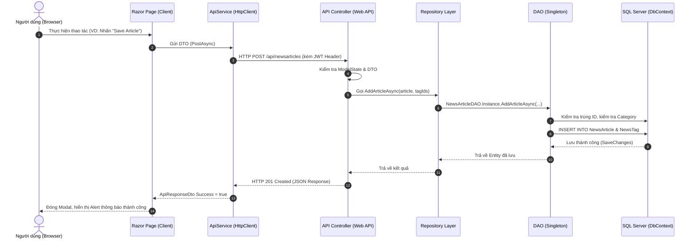

# BÁO CÁO PHÂN TÍCH CHI TIẾT DỰ ÁN FU NEWS MANAGEMENT SYSTEM
> **Môn học**: PRN232 - Assignment 01  
> **Nền tảng**: .NET 8 (ASP.NET Core Web API + OData v8 + Entity Framework Core 8 + ASP.NET Core Razor Pages)  
> **Tác giả**: Lê Thanh Hùng  

---

## MỤC LỤC
1. [Tổng quan dự án & Kiến trúc tổng thể](#1-tổng-quan-dự-án--kiến-trúc-tổng-thể)
2. [Các thành phần cốt lõi và ý nghĩa](#2-các-thành-phần-cốt-lõi-và-ý-nghĩa)
3. [Tầng Controller: Vai trò, phương thức và tác dụng chi tiết](#3-tầng-controller-vai-trò-phương-thức-và-tác-dụng-chi-tiết)
   - [3.1. AuthController (`api/auth`)](#31-authcontroller-apiauth)
   - [3.2. AccountsController (`api/accounts`)](#32-accountscontroller-apiaccounts)
   - [3.3. CategoriesController (`api/categories`)](#33-categoriescontroller-apicategories)
   - [3.4. NewsArticlesController (`api/newsarticles`)](#34-newsarticlescontroller-apinewsarticles)
   - [3.5. TagsController (`api/tags`)](#35-tagscontroller-apitags)
   - [3.6. ReportsController (`api/reports`)](#36-reportscontroller-apireports)
4. [Luồng luân chuyển dữ liệu (Data & Request Flow)](#4-luồng-luân-chuyển-dữ-liệu-data--request-flow)
5. [Cơ chế Phân quyền (Role-Based Authorization) & Ràng buộc nghiệp vụ](#5-cơ-chế-phân-quyền-role-based-authorization--ràng-buộc-nghiệp-vụ)

---

## 1. TỔNG QUAN DỰ ÁN & KIẾN TRÚC TỔNG THỂ

Dự án **FU News Management System** là hệ thống quản lý tin tức trường đại học, xây dựng theo mô hình **Client - Server phân tách hoàn toàn (Decoupled Architecture)**:

```
Assignment/
├── 27_Assignment01_BackEnd/       # Solution Backend Web API
│   └── FUNewsManagementAPI/       # Dự án Web API duy nhất (Single Project Pattern)
│       ├── Controllers/           # Tiếp nhận HTTP Request & OData endpoints
│       ├── DAO/                   # Xử lý truy vấn CSDL (Singleton Pattern) + DbContext
│       ├── DTOs/                  # Đối tượng truyền nhận dữ liệu
│       ├── Models/                # Entity Framework Core Data Entities
│       └── Repositories/          # Interface & Implementation (Repository Pattern)
│
├── 27_Assignment01_FrontEnd/      # Solution Frontend Client
│   └── FUNewsManagementClient/    # Ứng dụng Razor Pages tiêu thụ API qua HttpClient
│       ├── Pages/                 # Giao diện người dùng (Public, Admin, Staff)
│       ├── Services/              # ApiService gọi Backend API
│       ├── Helpers/               # Quản lý Session & Cookie
│       └── DTOs/                  # DTO độc lập phía Client (Loose Coupling)
│
└── FUNewsManagement.sql           # Kịch bản khởi tạo Cơ sở dữ liệu SQL Server
```

### Điểm nổi bật về mặt kỹ thuật:
- **Single Project Backend**: Gom toàn bộ Controllers, Repositories, DAO, DTOs, Models trong 1 project `FUNewsManagementAPI` duy nhất, đáp ứng đúng yêu cầu cấu trúc gọn nhẹ mà vẫn giữ chuẩn kiến trúc phân tầng.
- **Không phụ thuộc nhị phân (Zero Binary Dependency)**: Client không tham chiếu đến DLL của Backend mà giao tiếp 100% qua chuẩn giao thức **RESTful HTTP/JSON** và **OData v8**.
- **OData v8**: Cho phép các Controller trả về `IQueryable` kết hợp attribute `[EnableQuery]`, hỗ trợ client tự lọc, sắp xếp, phân trang bằng các cú pháp chuẩn như `$filter`, `$orderby`, `$select`, `$top`, `$skip`.

---

## 2. CÁC THÀNH PHẦN CỐT LÕI VÀ Ý NGHĨA

| Thành phần | Thư mục | Ý nghĩa & Trách nhiệm |
| :--- | :--- | :--- |
| **Models (Entities)** | `Models/` | Đại diện cho các bảng trong SQL Server (`Category`, `NewsArticle`, `NewsTag`, `SystemAccount`, `Tag`). Chứa các quan hệ Navigation Properties giữa các bảng (1-n, n-n). |
| **DbContext** | `DAO/` | `FUNewsManagementDbContext` kế thừa từ `DbContext` của Entity Framework Core, cấu hình quan hệ khóa chính, khóa ngoại, quan hệ n-n giữa NewsArticle và Tag qua bảng trung gian NewsTag. |
| **DAO (Data Access Object)** | `DAO/` | Áp dụng thiết kế **Singleton Pattern** (`Instance`). Đây là nơi duy nhất trực tiếp tương tác với `DbContext` để thực hiện câu lệnh LINQ / SQL. Chịu trách nhiệm kiểm tra toàn vẹn dữ liệu (trùng ID, trùng Email, v.v.). |
| **Repositories** | `Repositories/` | Áp dụng **Repository Pattern** với Interface (`IRepository`) và Class thực thi (`Repository`). Tách rời tầng Controller khỏi tầng truy cập dữ liệu, hỗ trợ **Dependency Injection (DI)** vào Controller. |
| **DTOs (Data Transfer Objects)** | `DTOs/` | Định hình dữ liệu gửi lên và trả về giữa Client và API. Giúp: <br>1. Che giấu các trường nhạy cảm (như mật khẩu không trả ra ngoài).<br>2. Tránh lỗi đệ quy vòng (Cyclic References) khi serialize quan hệ 2 chiều trong EF Core.<br>3. Ngăn chặn tấn công Over-posting / Mass Assignment. |
| **Controllers** | `Controllers/` | Tầng xử lý tiếp nhận Request từ mạng, validate `ModelState`, điều phối các Repository và trả về Response với HTTP Status Code thích hợp. |
| **ApiService** | Client `Services/` | Được cấu hình `HttpClient` tập trung, đóng gói việc gọi API (GET, POST, PUT, DELETE), quản lý `Authorization: Bearer <token>` và parse JSON an toàn. |

---

## 3. TẦNG CONTROLLER: VAI TRÒ, PHƯƠNG THỨC VÀ TÁC DỤNG CHI TIẾT

### Controller dùng để làm gì?
Controller là **"Bộ điều khiển" / "Cổng giao tiếp ngoài cùng"** của Web API. Khi người dùng hoặc ứng dụng Client gửi một yêu cầu HTTP đến máy chủ:
1. **Routing**: Định tuyến URL (VD: `GET api/newsarticles/1`) đến đúng hàm (Action Method) phụ trách.
2. **Model Binding & Validation**: Tự động lấy dữ liệu từ URL, Query String hoặc JSON Body và kiểm tra tính hợp lệ (`ModelState.IsValid`).
3. **Orchestration**: Nhận yêu cầu và gọi tầng **Repository** tương ứng để xử lý nghiệp vụ, tuyệt đối không viết câu lệnh truy vấn CSDL trực tiếp trong Controller.
4. **Format & Status Code**: Đóng gói kết quả trả về đúng chuẩn HTTP Status Code (200 OK, 201 Created, 400 BadRequest, 401 Unauthorized, 404 NotFound, 409 Conflict, 500 Error).
5. **OData Querying**: Tích hợp `[EnableQuery]` để bộ máy OData tự động chuyển đổi các câu query URL thành câu lệnh SQL tối ưu.

---

### 3.1. `AuthController` (`Route: api/auth`)
*Phụ trách toàn bộ việc xác thực danh tính người dùng và cấp phát Token JWT.*

| Phương thức | HTTP Method & Route | Tham số đầu vào | Tác dụng & Chi tiết xử lý |
| :--- | :--- | :--- | :--- |
| `Login` | `POST api/auth/login` | `[FromBody] LoginRequest request` (Email, Password) | - **Bước 1**: Kiểm tra tài khoản Admin đặc biệt từ file `appsettings.json` (`admin@FUNewsManagementSystem.org`). Nếu đúng, cấp quyền `Admin`.<br>- **Bước 2**: Nếu không phải admin, tra cứu tài khoản trong CSDL qua `ISystemAccountRepository.LoginAsync()`.<br>- **Bước 3**: Tạo chuỗi **JWT Bearer Token** chứa các Claims (`NameIdentifier`, `Name`, `Email`, `Role`) ký bằng mã bí mật HMAC-SHA256, hạn dùng 180 phút.<br>- Trả về `LoginResponse` chứa thông tin user và Token. |

---

### 3.2. `AccountsController` (`Route: api/accounts`)
*Kế thừa `ODataController` - Phụ trách quản lý tài khoản người dùng hệ thống (`SystemAccount`). Dành riêng cho Admin và trang cá nhân Staff.*

| Phương thức | HTTP Method & Route | Tham số đầu vào | Tác dụng & Chi tiết xử lý |
| :--- | :--- | :--- | :--- |
| `GetAccounts` | `GET api/accounts`<br>`[EnableQuery]` | *(OData query string)* | Lấy danh sách toàn bộ tài khoản trong hệ thống kèm số lượng bài viết do tài khoản đó tạo (`CreatedArticlesCount`). Hỗ trợ lọc OData `$filter`, `$orderby`. |
| `GetAccount` | `GET api/accounts/{id}` | `short id` | Lấy thông tin chi tiết một tài khoản theo ID. Trả về `404 NotFound` nếu không tồn tại. |
| `CreateAccount` | `POST api/accounts` | `[FromBody] AccountCreateUpdateDto dto` | Tạo mới tài khoản (chỉ Admin). Kiểm tra tính toàn vẹn: cấm trùng `AccountId`, cấm trùng `AccountEmail`. Nếu trùng báo lỗi `409 Conflict`. Trả về `201 CreatedAtAction`. |
| `UpdateAccount` | `PUT api/accounts/{id}` | `short id`, `[FromBody] AccountCreateUpdateDto dto` | Cập nhật tên, email, vai trò, mật khẩu của tài khoản. Kiểm tra không được trùng email với tài khoản khác. Trả về `200 OK`. |
| `DeleteAccount` | `DELETE api/accounts/{id}` | `short id` | Xóa tài khoản khỏi hệ thống.<br>⚠️ **Ràng buộc nghiệp vụ bắt buộc**: Nếu tài khoản đã từng tạo bất kỳ bài viết tin tức nào (`HasCreatedArticlesAsync == true`), API sẽ **chặn xóa** và trả về `400 BadRequest` để bảo vệ dữ liệu lịch sử bài viết. |
| `UpdateProfile` | `PUT api/accounts/profile/{id}` | `short id`, `[FromBody] ProfileUpdateDto dto` | Dành cho Staff tự chỉnh sửa thông tin cá nhân (Tên, Email, đổi Mật khẩu mới nếu muốn). |

---

### 3.3. `CategoriesController` (`Route: api/categories`)
*Kế thừa `ODataController` - Quản lý các chuyên mục tin tức (`Category`). Hỗ trợ danh mục cha - con (Parent-Child Hierarchy).*

| Phương thức | HTTP Method & Route | Tham số đầu vào | Tác dụng & Chi tiết xử lý |
| :--- | :--- | :--- | :--- |
| `GetCategories` | `GET api/categories`<br>`[EnableQuery]` | `[FromQuery] bool? activeOnly` | Lấy danh sách tất cả danh mục. Nếu `activeOnly == true` thì chỉ lấy danh mục đang hoạt động (dùng cho trang công khai). Trả về kèm tên danh mục cha (`ParentCategoryName`) và số bài viết con (`ArticleCount`). |
| `GetCategory` | `GET api/categories/{id}` | `short id` | Lấy thông tin chi tiết của 1 danh mục theo mã `id`. |
| `CreateCategory` | `POST api/categories` | `[FromBody] CategoryCreateUpdateDto dto` | Thêm danh mục mới (Staff). Cho phép chọn danh mục cha (`ParentCategoryId`) hoặc để null (danh mục gốc). Trả về `201 Created`. |
| `UpdateCategory` | `PUT api/categories/{id}` | `short id`, `[FromBody] CategoryCreateUpdateDto dto` | Sửa tên danh mục, mô tả, danh mục cha và trạng thái kích hoạt `IsActive`. |
| `DeleteCategory` | `DELETE api/categories/{id}` | `short id` | Xóa danh mục.<br>⚠️ **Ràng buộc nghiệp vụ bắt buộc**: Chặn xóa và trả về `400 BadRequest` nếu danh mục đang chứa bài viết tin tức hoặc đang có các danh mục con trực thuộc. |

---

### 3.4. `NewsArticlesController` (`Route: api/newsarticles`)
*Kế thừa `ODataController` - Đây là Controller trung tâm của toàn bộ hệ thống, xử lý quản lý tin tức và gán thẻ Tag.*

| Phương thức | HTTP Method & Route | Tham số đầu vào | Tác dụng & Chi tiết xử lý |
| :--- | :--- | :--- | :--- |
| `GetArticles` | `GET api/newsarticles`<br>`[EnableQuery]` | `bool? activeOnly`<br>`string? keyword`<br>`short? categoryId`<br>`int? tagId` | Truy vấn danh sách bài viết đa tiêu chí: Lọc bài kích hoạt (`activeOnly=true`), tìm kiếm từ khóa trong Title/Headline/Content, lọc theo CategoryId, lọc theo TagId. Hỗ trợ query OData. Trả về danh sách DTO kèm CategoryName, CreatedByName và danh sách Tags. |
| `GetArticle` | `GET api/newsarticles/{id}` | `string id` | Lấy chi tiết một bài viết theo mã định danh (VD: `1`, `NA001`), nạp đầy đủ thông tin Category, Author, Tags đính kèm. |
| `GetArticlesByAuthor` | `GET api/newsarticles/author/{authorId}` | `short authorId` | Lấy toàn bộ lịch sử các bài viết được tạo bởi chính tác giả đó (phục vụ chức năng **My News History** của Staff). Sắp xếp giảm dần theo ngày tạo. |
| `CreateArticle` | `POST api/newsarticles` | `[FromBody] NewsArticleCreateUpdateDto dto`<br>`[FromQuery] short? createdById` | Thêm bài viết mới (Staff):<br>1. Kiểm tra không được trùng `NewsArticleId`.<br>2. Kiểm tra `CategoryId` hợp lệ.<br>3. Gán thời gian `CreatedDate = DateTime.Now` và người tạo `CreatedById`.<br>4. Tự động lưu các thẻ Tag liên kết vào bảng `NewsTag`. Trả về `201 CreatedAtAction`. |
| `UpdateArticle` | `PUT api/newsarticles/{id}` | `string id`<br>`[FromBody] NewsArticleCreateUpdateDto dto`<br>`[FromQuery] short? updatedById` | Sửa bài viết (Staff): Cập nhật tiêu đề, nội dung, nguồn, trạng thái, người sửa (`UpdatedById`), ngày sửa (`ModifiedDate = DateTime.Now`), đồng bộ hóa lại danh sách Tags (xóa tag cũ bị bỏ, thêm tag mới được chọn). |
| `DeleteArticle` | `DELETE api/newsarticles/{id}` | `string id` | Xóa bài viết: Tự động dọn dẹp các liên kết trong bảng `NewsTag` trước, sau đó xóa bài viết khỏi bảng `NewsArticle`. |

---

### 3.5. `TagsController` (`Route: api/tags`)
*Kế thừa `ODataController` - Quản lý danh mục các hashtag / thẻ phân loại bài viết.*

| Phương thức | HTTP Method & Route | Tham số đầu vào | Tác dụng & Chi tiết xử lý |
| :--- | :--- | :--- | :--- |
| `GetTags` | `GET api/tags`<br>`[EnableQuery]` | *(OData query string)* | Lấy danh sách toàn bộ các Tag có trong hệ thống (dùng để đổ dữ liệu vào checkbox chọn Tag ở Modal tạo/sửa bài viết). |
| `GetTag` | `GET api/tags/{id}` | `int id` | Lấy chi tiết 1 Tag theo mã `TagId`. |
| `CreateTag` | `POST api/tags` | `[FromBody] Tag tag` | Tạo mới một Tag. |
| `UpdateTag` | `PUT api/tags/{id}` | `int id`, `[FromBody] Tag tag` | Cập nhật tên thẻ `TagName` hoặc ghi chú `Note`. |
| `DeleteTag` | `DELETE api/tags/{id}` | `int id` | Xóa một Tag khỏi hệ thống. |

---

### 3.6. `ReportsController` (`Route: api/reports`)
*Phụ trách chức năng thống kê báo cáo của quản trị viên (Admin Report).*

| Phương thức | HTTP Method & Route | Tham số đầu vào | Tác dụng & Chi tiết xử lý |
| :--- | :--- | :--- | :--- |
| `GetStatistics` | `GET api/reports/statistics` | `[FromQuery] DateTime startDate`<br>`[FromQuery] DateTime endDate` | **Chức năng báo cáo bài viết**: <br>1. Kiểm tra tính hợp lệ: `startDate` phải nhỏ hơn hoặc bằng `endDate`.<br>2. Lọc tất cả các bài viết có `CreatedDate` nằm trong khoảng từ `[startDate 00:00:00]` đến `[endDate 23:59:59]`.<br>3. Bắt buộc sắp xếp **giảm dần theo ngày tạo (`CreatedDate Descending`)** theo đúng yêu cầu đề bài.<br>4. Trả về `ReportStatisticDto` bao gồm: Tổng số bài viết (`TotalArticles`) và Danh sách chi tiết từng bài viết. |

---

## 4. LUỒNG LUÂN CHUYỂN DỮ LIỆU (DATA & REQUEST FLOW)

Sơ đồ tuần tự xử lý một tác vụ từ giao diện người dùng đến cơ sở dữ liệu:



---

## 5. CƠ CHẾ PHÂN QUYỀN (ROLE-BASED AUTHORIZATION) & RÀNG BUỘC NGHIỆP VỤ

### 1. Phân quyền theo 3 vai trò:
- **Khách vãng lai (Public / Anonymous)**:
  - Chỉ xem các bài viết có trạng thái kích hoạt (`NewsStatus == true`).
  - Tìm kiếm bài viết theo từ khóa, lọc theo danh mục, đọc bài viết chi tiết qua Modal.
  - Không thể truy cập vào các đường dẫn quản trị `/Admin/*` hay `/Staff/*`.
- **Nhân viên (Staff - Role 1)**:
  - Quản lý danh mục (Category Management) qua Modal Popup.
  - Quản lý bài viết tin tức (News Article Management) + Chọn gán Tags qua Modal.
  - Xem lịch sử bài viết của chính mình (My News History).
  - Quản lý trang cá nhân (Profile) và đổi mật khẩu.
- **Quản trị viên (Admin)**:
  - Quản lý toàn bộ tài khoản hệ thống (SystemAccount Management) qua Modal Popup (tự động gợi ý Account ID theo thứ tự).
  - Thống kê báo cáo bài viết theo khoảng ngày (Report Statistics).
  - Xuất báo cáo bài viết ra định dạng file Excel (`.xlsx`) chuyên nghiệp (sử dụng ClosedXML, định dạng màu sắc header, viền ô, căn lề và tự động điều chỉnh độ rộng cột).

### 2. Các ràng buộc nghiệp vụ chặt chẽ (Business Constraints):
1. **Kiểm tra trùng lặp khóa chính & Email**: Khi thêm tài khoản, hệ thống kiểm tra cả trùng `AccountId` lẫn trùng `AccountEmail`.
2. **Bảo vệ toàn vẹn dữ liệu khi xóa tài khoản**: Cấm xóa tài khoản nếu tài khoản đó đã từng là tác giả đứng tên bất kỳ bài viết nào.
3. **Bảo vệ toàn vẹn dữ liệu khi xóa danh mục**: Cấm xóa danh mục nếu danh mục đó đang chứa bài viết hoặc có danh mục con trực thuộc.
4. **Bảo đảm tính hợp lệ của bài viết**: Khi tạo bài viết, `CategoryId` bắt buộc phải tồn tại trong CSDL. Các liên kết `NewsTag` được tự động tạo và dọn dẹp khi cập nhật hoặc xóa bài viết.
